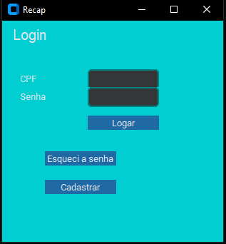
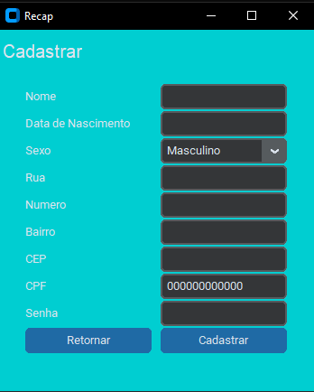
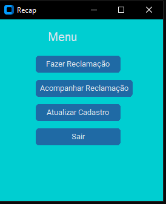
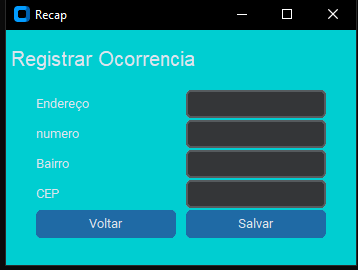
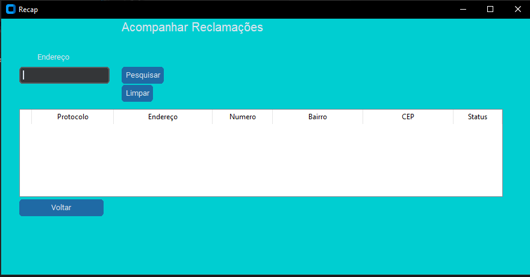

# Protótipo de Aplicação em Python Recap

Este é um protótipo de aplicação desenvolvido para o Projeto Integrador 1.

O projeto que desenvolvemos é uma solução que visa identificar o local exato de falhas e defeitos em vias públicas.

O protótipo foi desenvolvido em Python, utilizando as bibliotecas Tkinter e SQLite.

Ele permite que os moradores se cadastrem e relatem ocorrências, como buracos e outros tipos de falhas em vias públicas, de forma mais fácil e acessível para a prefeitura.

## Funcionalidades

- **Login**: permite que os usuários façam login na aplicação.
- **Cadastro**: possibilita que novos usuários se cadastrem na plataforma.
- **Registrar Ocorrência**: permite que os usuários registrem reclamações sobre defeitos.
- **Acompanhar Ocorrência**: possibilita que os usuários acompanhem o status das ocorrências registradas.

## Screenshots

